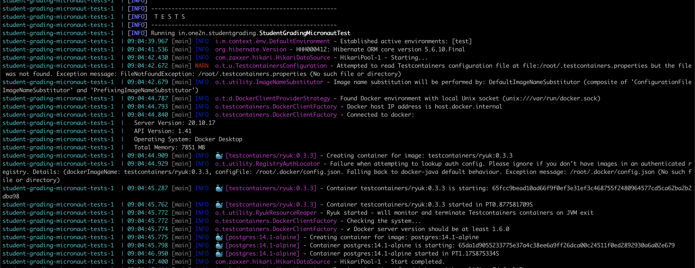

## Micronaut Postgres

### Use with Docker Development Environment

    A sample Micronaut application to set up fast local development with hot reload inside docker.
    We will use Maven and Gradle as the build tools for our application.

## Outcome

By doing `docker-compose up` inside the working directory you should be able to run the Micronaut
application. The app is compiled in docker. Your code changes will be automatically compiled and hot reloaded without
having to restart the app or docker container.


### Micronaut + Postgres + Docker

### Step-1:
`FOR MAVEN PROJECTS:`
- Add `Dockerfile` and `docker-compose.yml` files to the working directory. Then the
  project structure would be as shown below.

```
<working-dir>
├── ...
├── src
|     └── ...
├── Dockerfile
├── docker-compose.yml
└── README.md
```

Now, copy the content from the template  `Dockerfile` and `docker-compose.yml` files provided below and paste it into newly
created __Dockerfile__ and __docker-compose.yml__ files in your project.

`FOR GRADLE PROJECT:`
- Add `Dockerfile-Gradle` and `docker-compose-gradle.yml` to the working directory.

```
<working-dir>
├── ...
├── src
|     └── ...
├── Dockerfile-Gradle
├── docker-compose-gradle.yml
└── README.md
```

### Template for Dockerfile and docker-compose.yml files

`FOR MAVEN PROJECT:`

[Dockerfile](https://github.com/chinmaysomani07/student-grading-micronaut/blob/dockerise-setup/Dockerfile)

 ```dockerfile
FROM openjdk:11

WORKDIR /app

COPY .mvn .mvn
COPY mvnw pom.xml ./
RUN ./mvnw -T 4 dependency:go-offline

COPY src ./src

CMD ["./mvnw", "mn:run", "-Dmn.watch=true"]
 ```

[docker-compose.yml](https://github.com/chinmaysomani07/student-grading-micronaut/blob/dockerise-setup/docker-compose.yml)

 ```yaml
version: '3.8'
services:
  micronaut-postgres:
    image: micronaut-postgres-image
    container_name: micronaut-postgres-container
    networks:
      - micronaut-postgres-network
    build:
      context: .
    env_file: .env
    depends_on:
      - db
    ports:
      - ${APPLICATION_PORT_ON_DOCKER_HOST}:${APPLICATION_PORT_ON_CONTAINER}
    volumes:
      - ./:/app
    command: ./mvnw mn:run

  db:
    container_name: student-grading-db
    image: postgres:14.1-alpine
    env_file: .env
    environment:
      - POSTGRES_DB=${DB_NAME}
      - POSTGRES_USER=${POSTGRES_USER}
      - POSTGRES_PASSWORD=${POSTGRES_PASSWORD}
    ports:
      - ${DB_PORT_ON_DOCKER_HOST}:${DB_PORT_ON_CONTAINER}
    volumes:
      - db:/var/lib/postgresql/data
    networks:
      - student-grading-network


volumes:
  db:

networks:
  student-grading-network:

 ```


`FOR GRADLE PROJECT:`

[Dockerfile-Gradle](https://github.com/chinmaysomani07/student-grading-micronaut/blob/dockerise-setup/Dockerfile-Gradle)

```dockerfile
FROM openjdk:11

WORKDIR /app

COPY gradle gradle
COPY gradlew build.gradle gradle.properties ./
COPY src ./src

RUN ./gradlew clean build -x test

CMD ["./gradlew", "run", "-t"]

 ```

[docker-compose-gradle.yml](https://github.com/chinmaysomani07/student-grading-micronaut/blob/dockerise-setup/docker-compose.yml)

```yaml
version: '3.8'
services:
  micronaut-postgres:
    image: micronaut-postgres-image
    container_name: micronaut-postgres-container
    networks:
      - micronaut-postgres-network
    build:
      context: .
      dockerfile: Dockerfile-Gradle
    env_file: .env
    depends_on:
      - db
    ports:
      - ${APPLICATION_PORT_ON_DOCKER_HOST}:${APPLICATION_PORT_ON_CONTAINER}
      - ${DEBUG_PORT_ON_DOCKER_HOST}:${DEBUG_PORT_ON_CONTAINER}
    volumes:
      - ./:/app
    command: ./gradlew run -t

  db:
    container_name: postgres-container
    image: postgres:14.1-alpine
    env_file: .env
    ports:
      - ${DB_PORT_ON_DOCKER_HOST}:${DB_PORT_ON_CONTAINER}
    volumes:
      - db:/var/lib/postgresql/data
    networks:
      - micronaut-postgres-network


volumes:
  db:

networks:
  micronaut-postgres-network:
```


Here each service acts as a new container. Since our application is dependent on `db` service, We need
to take care of a few things like -

- `micronaut-postgres` service shouldn't start before `db` service. And that is why we
  used `depend_on` property under `micronaut-postgres`.
- `micronaut-postgres` service and `db` both have to in the same network, so that they
  can communicate with each other. If we don't provide any network to services, they might run in
  isolated networks which leads to communication link failure between the application and database.
- Finally, for hot reload to happen inside docker, our current directory(where the source code exists)
  should be mounted to the working directory inside the container.

```yaml
volumes:
  - ./:/app
```

### Step-2:

### How to pass values to variables in `docker-compose.yml` and `docker-compose-gradle.yml` file?

In the `docker-compose.yml` and `docker-cmompose-gradle.yml` files, you would see that the variables are used
like `${APPLICATION_PORT_ON_DOCKER_HOST}`, `${APPLICATION_PORT_ON_CONTAINER}`,  
`${DB_NAME}`, `${POSTGRES_USER}`, `${POSTGRES_PASSWORD}`, `${DB_PORT_ON_DOCKER_HOST}`
and `${DB_PORT_ON_CONTAINER}`. One might think(people new to docker) that how would we pass values
to
these variables? Well there are a couple of ways to do that, one is by defining under
the `environment` property of any service(example to refer, under `db` service). Another way is to
define all these values
inside [.env](https://github.com/chinmaysomani07/student-grading-micronaut/blob/dockerise-setup/.env)
file, and then map it to the service with the property `env_file` as we did in
both `micronaut-postgres` and `db` services.


### Step-3:

### How to run docker-compose file?

Follow the commands to run docker-compose file

1. Change directory in Terminal or CMD to `<working-dir>`

> $ cd `<PATH-TO-WORKING-DIR>`

2. Run the `docker-compose.yml` or `docker-compose-gradle.yml` files depending on the build tool you are using i.e Maven or Gradle.

`IN CASE OF MAVEN APPLICATION:`

> $ docker-compose up

`IN CASE OF GRADLE APPLICATION:`

> $ docker-compose -f docker-compose-gradle.yml up


If you're running `docker-compose up` command for the first time, it would take 7-10 minutes to pull
images(
openjdk:11) and downloading dependencies. If everything runs successfully, by doing `docker ps` you
would see the following outcome.

```
➜  student-grading-micronaut ✗ docker ps
CONTAINER ID   IMAGE                             COMMAND                  CREATED          STATUS          PORTS                                            NAMES
8247f3b42566   micronaut-postgres-image          "./mvnw mn:run -Dmn.…"   29 seconds ago   Up 25 seconds   0.0.0.0:8080->8080/tcp           student-grading-micronaut-app
04a7dbf0c0e3   postgres:14.1-alpine              "docker-entrypoint.s…"   4 minutes ago    Up 4 minutes    5432/tcp                         student-grading-db
```

If the application fails to start, you would still figure out why it fails by the below command.
> docker logs --follow <container-name>

Make actions according to the logs.

## How to run E2E tests inside docker?

To run End-To-End(E2E) tests, we need to mock the server and database. One way to do that is by
using
[test containers](https://www.testcontainers.org/).

Adding `docker-compose-test.yml` file would help to run the test inside docker. Then the project structure is:

```
<working-dir>
├── ...
├── src
|     └── ...
├── Dockerfile
├── docker-compose.yml
├── docker-compose-test.yml
└── README.md
```

[docker-compose-test.yml](https://github.com/chinmaysomani07/student-grading-micronaut/blob/dockerise-setup/docker-compose-test.yml)

```yaml
version: '3.8'
services:

  tests:
    image: maven:3
    stop_signal: SIGKILL
    stdin_open: true
    tty: true
    working_dir: /app
    environment:
      - TESTCONTAINERS_HOST_OVERRIDE=host.docker.internal
    volumes:
      - ./:/app
      - /var/run/docker.sock:/var/run/docker.sock
      # Maven cache (optional), if .m2 repository isn't mounted, maven will download all
      # the dependencies mentioned in 'pom.xml' from mvn central repository.
      - ~/.m2:/root/.m2
    command: mvn clean test
```

Here `~/.m2` is specific to mac, if you're using different platform, replace `~/.m2`
with `C:\Users\{your-username}\.m2` for windows or `/root/.m2` for linux.


Follow the command to run tests inside docker.

1. Change the directory in Terminal or CMD to `<working-dir>`

> $ cd `<PATH-TO-WORKING-DIR>`

2. Run the `docker-compose-test.yml` file.

> $ docker-compose -f docker-compose-test.yml up

If you're not mounting the `.m2` then it would time take to download all the dependencies mentioned
in `pom.xml`.

Once the dependencies are mounted or downloaded, you would see the following logs as a good sign -




