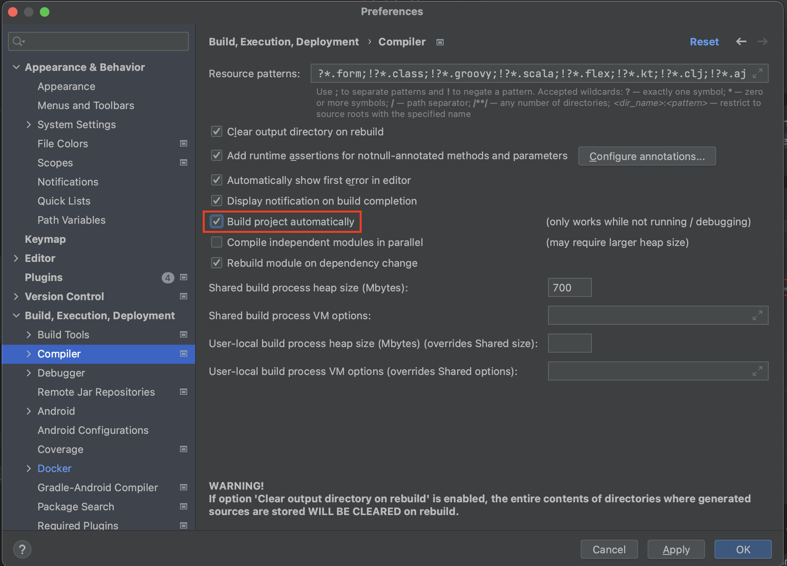
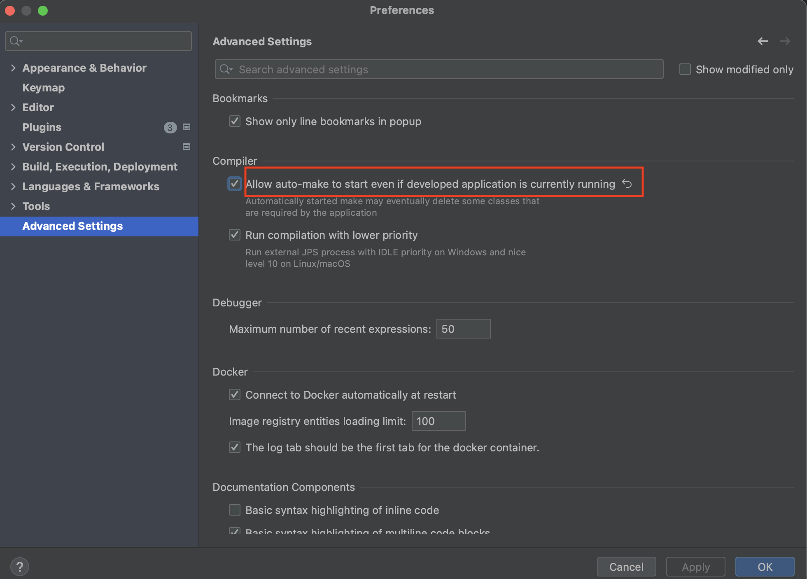
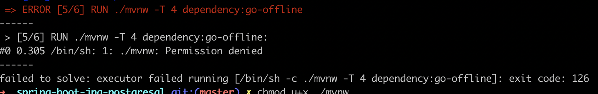
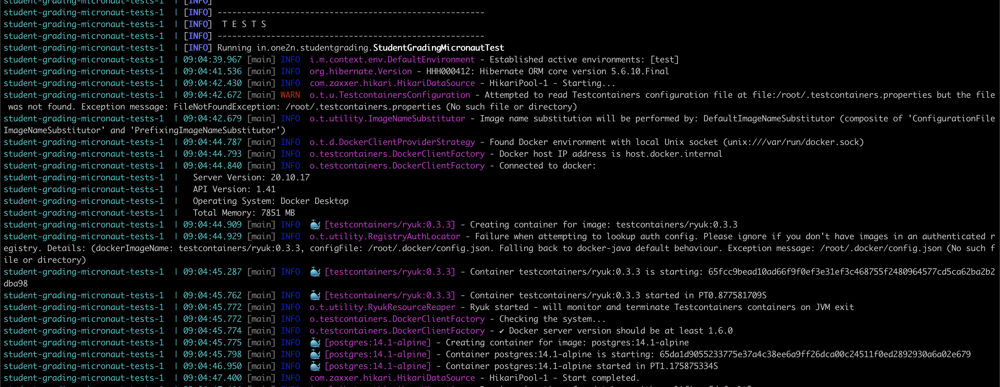

## Spring-Boot Postgres

### Use with Docker Development Environment

     A sample SpringBoot application to set up fast local development with hot reload and debugger inside docker. 
     We will use Maven and Gradle as the build tools for our application.

## Outcome

By doing `docker-compose up` inside the working directory you should be able to run the SpringBoot
application. The app is compiled in docker. Your code changes will be automatically compiled and hot reloaded without
having to restart the app or docker container.


NOTE:

In the case of a Maven project, to achieve hot reload inside docker, you just need to add the `Dockerfile` and `docker-compose.yml` files to the
existing project.
In the case of a Gradle project, to achieve hot reload inside docker, you just need to add the `Dockerfile-Gradle` and `docker-compose-gradle.yml` to the
existing project.
But it isn't straightforward in the case of a SpringBoot application. You need to
perform additional checks i.e does hot reload work locally?

For hot reload to work in a SpringBoot application you need to
have `spring-boot-devtools` dependency
inside `pom.xml` for the Maven project and inside build.gradle for Gradle project.


## SpringBoot + Postgres + Docker

### Step-1:

`FOR MAVEN PROJECT:`

To ensure that hot reload works locally, we need to
add `spring-boot-devtools` dependency to `pom.xml` which helps to re-run the application when the
changes are detected.

Add the below dependency to `pom.xml`
```xml
<dependency>
    <groupId>org.springframework.boot</groupId>
    <artifactId>spring-boot-devtools</artifactId>
    <scope>runtime</scope>
</dependency>
```

`FOR GRADLE PROJECT:`

To ensure that hot reload works locally, we need to
add `spring-boot-devtools` dependency to `build.gradle` which helps to re-run the application when the
changes are detected.

Add the below dependency to `build.gradle`
```gradle
dependencies{
    developmentOnly 'org.springframework.boot:spring-boot-devtools'
}
```


> __Note__: If you're using IntelliJ, after adding `devtools` dependency you need to enable two properties
> named `Build project automatically`
> and `Allow auto-make to start even if developed application is currently running` as shown in the figures below.





After applying these changes run your application. After the application is up and running, do
some changes to your code base, and then you can see in the console that the application is
automatically restarted
without hitting the run button.

### Step-2:

`FOR MAVEN PROJECT:`

Add `Dockerfile` and `docker-compose.yml` to the working directory.

Project structure after adding `Dockerfile` and `docker-compose.yml`

```
<working-dir>
├── ...
├── src
|     └── ...
├── Dockerfile
├── docker-compose.yml
└── README.md
```

Now, copy the content from the template  `Dockerfile` and `docker-compose.yml` files provided below and paste it into newly
created __Dockerfile__ and __docker-compose.yml__ files in your project.

`FOR GRADLE PROJECT:`

Add `Dockerfile-Gradle` and `docker-compose-gradle.yml` to the working directory.

```
<working-dir>
├── ...
├── src
|     └── ...
├── Dockerfile-Gradle
├── docker-compose-gradle.yml
└── README.md
```


`FOR MAVEN PROJECT:`

#### Templates of Dockerfile and docker-compose

[Dockerfile](./Dockerfile)

```dockerfile
FROM openjdk:11

WORKDIR /app

COPY .mvn .mvn
COPY mvnw pom.xml ./
RUN ./mvnw -T 4 dependency:go-offline

COPY src ./src

CMD ["./mvnw", "spring-boot:run"]
```

[docker-compose.yml](./docker-compose.yml)

```yaml
version: '3.8'
services:
  spring-boot-postgres:
    image: spring-boot-postgres-image
    container_name: spring-boot-postgres-maven-container
    networks:
      - spring-boot-postgres-network
    build:
      context: .
    env_file: .env
    depends_on:
      - db
    ports:
      - ${APPLICATION_PORT_ON_DOCKER_HOST}:${APPLICATION_PORT_ON_CONTAINER}
      - ${DEBUG_PORT_ON_DOCKER_HOST}:${DEBUG_PORT_ON_CONTAINER}
    volumes:
      - ./:/app
    command: ./mvnw spring-boot:run -Dspring-boot.run.jvmArguments="-agentlib:jdwp=transport=dt_socket,server=y,suspend=n,address=*:${DEBUG_PORT_ON_CONTAINER}"

  db:
    container_name: spring-boot-postgres-db
    image: postgres:14.1-alpine
    env_file: .env
    ports:
      - ${DB_PORT_ON_DOCKER_HOST}:${DB_PORT_ON_CONTAINER}
    volumes:
      - db:/var/lib/postgresql/data
    networks:
      - spring-boot-postgres-network

volumes:
  db:

networks:
  spring-boot-postgres-network:
```


`FOR GRADLE PROJECT:`

#### Templates of Dockerfile-Gradle and docker-compose-gradle

[Dockerfile-Gradle](./Dockerfile-Gradle)

```dockerfile-gradle
FROM openjdk:11

WORKDIR /app

COPY gradle gradle
COPY gradlew build.gradle ./
COPY src ./src

RUN ./gradlew clean build -x test

CMD ["./gradlew", "bootRun"]
```

[docker-compose-gradle.yml](./docker-compose-gradle.yml)

Below is the template of your docker-compose-gradle.yml.

```yaml
version: '3.8'
services:
  spring-boot-postgres:
    image: spring-boot-postgres-image
    container_name: spring-boot-postgres-gradle-container
    networks:
      - spring-boot-postgres-network
    build:
      context: .
      dockerfile: Dockerfile-Gradle
    env_file: .env
    depends_on:
      - db
    ports:
      - ${APPLICATION_PORT_ON_DOCKER_HOST}:${APPLICATION_PORT_ON_CONTAINER}
      - ${DEBUG_PORT_ON_DOCKER_HOST}:${DEBUG_PORT_ON_CONTAINER}
    volumes:
      - ./:/app
    command: ./gradlew bootRun

  db:
    container_name: postgres-container
    image: postgres:14.1-alpine
    env_file: .env
    ports:
      - ${DB_PORT_ON_DOCKER_HOST}:${DB_PORT_ON_CONTAINER}
    volumes:
      - db:/var/lib/postgresql/data
    networks:
      - spring-boot-postgres-network

volumes:
  db:

networks:
  spring-boot-postgres-network:
```

Here each service acts as a new container. Since our application is dependent on `db` service, we need
to take care of a few things:

- `spring-boot-postgres` service shouldn't start before `db` service. And that is why we
  used `depends_on` property under `spring-boot-postgres`.
- `spring-boot-postgres` service and `db` both have to be on the same network, so that they
  can communicate with each other. If we don't provide any network to services, they might run in
  isolated networks which leads to communication link failure between the application and the database.
- Finally, for hot reloading of the app inside docker, our current directory(where the source code exists)
  should be mounted to the working directory inside the container.

```yaml
    volumes:
      - ./:/app
```

### Step-3:

In the `docker-compose.yml` and `docker-compose-gradle.yml` files, you would see that the variables used
like `${APPLICATION_PORT_ON_DOCKER_HOST}`, `${APPLICATION_PORT_ON_CONTAINER}`,  
and `${DB_PORT_ON_CONTAINER}`. One might think(people new to docker) how do we pass values
to
these variables? Well, there are different ways to do that, one of them is by defining under
the `environment` property of any service. Another way is to
define all these values
inside [.env](./.env).

Here, we'll be using `.env` file to pass values to these variables.

Create a [`.env`](./.env) file inside the working directory.

Then the project structure is:

`FOR MAVEN PROJECT:`
```
<working-dir>
├── ...
├── src
|     └── ...
├── .env
├── Dockerfile
├── docker-compose.yml
└── README.md
```

`FOR GRADLE PROJECT:`

```
<working-dir>
├── ...
├── src
|     └── ...
├── .env
├── Dockerfile-Gradle
├── docker-compose-gradle.yml
└── README.md
```


Replace the content of the newly created `.env` file with this [.env](./.env) file.

### Step-4:

Follow the commands to run docker-compose file

1. Change the directory in Terminal or CMD to `<working-dir>`

> $ cd `<PATH-TO-WORKING-DIR>`

2. Run the `docker-compose.yml` file in case of a maven application or `docker-compose-gradle.yml` file in case of a Gradle application.

`IN CASE OF A MAVEN APPLICATION:`
> $ docker-compose up

After doing this you may following error:



To solve this issue, execute the following command:

> chmod u+x ./mvnw

The issue will be solved. Again do a `docker-compose up`

`IN CASE OF A GRADLE APPLICATION:`
> docker-compose -f docker-compose-gradle.yml up


If you're running `docker-compose up` command for the first time, it may take up to 7-10 minutes to pull
image(
openjdk:11) and download dependencies. If everything runs successfully, by doing `docker ps` you
would see a similar outcome as shown below.

```
➜  student-grading-micronaut ✗ docker ps
CONTAINER ID   IMAGE                             COMMAND                  CREATED          STATUS          PORTS                                            NAMES
8247f3b42566   spring-boot-postgres-image        "./mvnw spring-boot:…"   29 seconds ago   Up 25 seconds   0.0.0.0:8080->8080/tcp   student-grading-micronaut-app
04a7dbf0c0e3   postgres:14.1-alpine              "docker-entrypoint.s…"   4 minutes ago    Up 4 minutes    5432/tcp                 student-grading-db
```

If the application failed to start, you can still figure out why it fails by executing the below command:
> $ docker logs --follow `<container-name>`

Take action according to the logs.

Now, while the application is up and running inside docker, make the changes to the code base, then you
would that application running inside docker should restart automatically.

You can also set a debug point, and hit an API that goes to that debug point using Postman, you can see you'll be redirected to IntelliJ and debug your code.

## How to run E2E tests inside docker?

To run End-To-End(E2E) tests, we need to mock the server and database. One way to do that is by
using
[test containers](https://www.testcontainers.org/).

Adding `docker-compose-test.yml` file helps us in running tests inside docker. Then the project structure looks like this:

```
<working-dir>
├── ...
├── src
|     └── ...
├── Dockerfile
├── docker-compose.yml
├── docker-compose-test.yml
└── README.md
```

[docker-compose-test.yml](https://github.com/chinmaysomani07/student-grading-micronaut/blob/dockerise-setup/docker-compose-test.yml)

```yaml
version: '3.8'
services:

  tests:
    image: maven:3
    stop_signal: SIGKILL
    stdin_open: true
    tty: true
    working_dir: /app
    environment:
      - TESTCONTAINERS_HOST_OVERRIDE=host.docker.internal
    volumes:
      - ./:/app
      - /var/run/docker.sock:/var/run/docker.sock
      # Maven cache (optional), if .m2 repository isn't mounted, maven will download all
      # the dependencies mentioned in 'pom.xml' from mvn central repository.
      - ~/.m2:/root/.m2
    command: mvn clean test
```

Here `~/.m2` is specific to mac, if you're using a different platform, replace `~/.m2`
with `C:\Users\{your-username}\.m2` for Windows or `/root/.m2` for Linux.

Follow the command to run tests inside docker.

1. Change directory in Terminal or CMD to `<working-dir>`

> $ cd `<PATH-TO-WORKING-DIR>`

2. Run the `docker-compose-test.yml` file.

> $ docker-compose -f docker-compose-test.yml up

If you're not mounting the `.m2` then it would take time to download all the dependencies mentioned
in `pom.xml`.

Once the dependencies are mounted or downloaded, you would see the following logs as a good sign -


